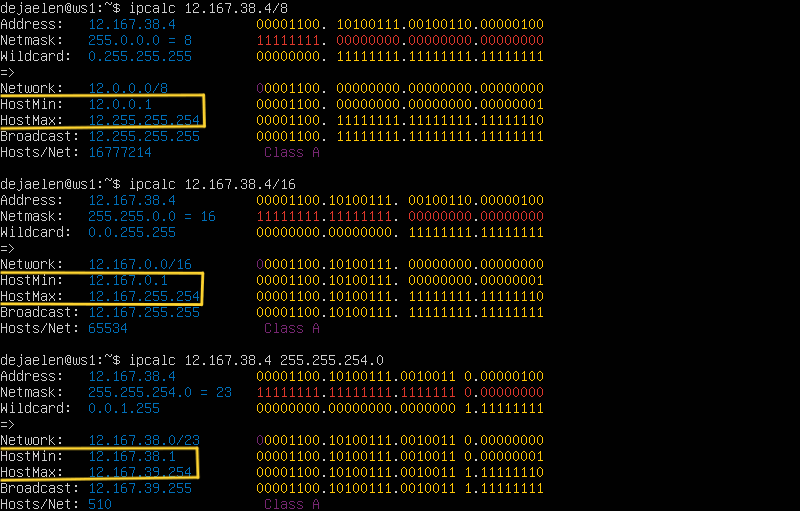
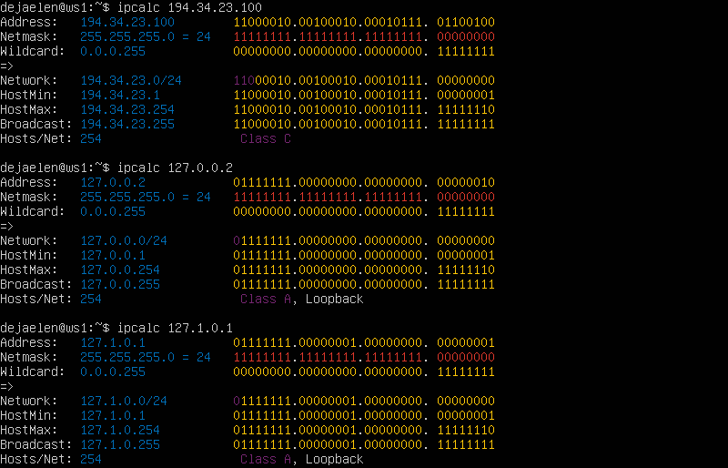
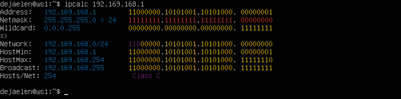
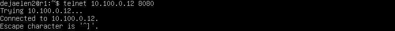
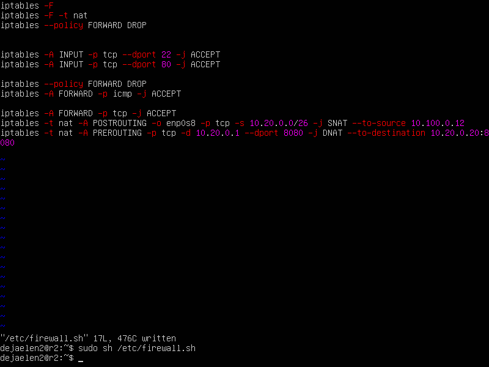

# Сети в Linux

Настройка сетей в Linux на виртуальных машинах.


   
## Contents
   1. [Инструмент ipcalc](#part-1-инструмент-ipcalc) \
      1.1 [Сети и маски](#11-сети-и-маски) \
      1.2 [localhost](#12-localhost) \
      1.3 [Диапазоны и сегменты сетей](#13-диапазоны-и-сегменты-сетей)
   2. [Статическая маршрутизация между двумя машинами](#part-2-статическая-маршрутизация-между-двумя-машинами) \
      2.1 [Добавление статического маршрута вручную](#21-добавление-статического-маршрута-вручную)\
      2.2 [Добавление статического маршрута с сохранением](#22-добавление-статического-маршрута-с-сохранением)
   3. [Утилита iperf3](#part-3-утилита-iperf3) \
      3.1 [Cкорость соединения](#31-скорость-соединения) \
      3.2 [Утилита iperf3](#32-утилита-iperf3)
   4. [Сетевой экран](#part-4-сетевой-экран) 
   5. [Статическая маршрутизация сети](#part-5-статическая-маршрутизация-сети) 
   6. [Динамическая настройка IP с помощью DHCP](#part-6-динамическая-настройка-ip-с-помощью-dhcp) 
   7. [NAT](#part-7-nat) 
   8. [Допополнительно. Знакомство с SSH Tunnels](#part-8-дополнительно-знакомство-с-ssh-tunnels)


## Part 1. Инструмент **ipcalc**
 
**ipcalc** - Устанвливаем калькулятор для расчета сетей. Маленькая и удобная утилитка по расчету сетевых адресов. 

<details>
<summary>Использование: ipcalc</summary>

`ipcalc [options] <ADDRESS> [[/]<NETMASK>] [NETMASK] `\
Опции:\
-n —nocolor Подавить вывод цветов.\
-b —nobinary Подавить поразрядный вывод.\
-c —class Показать маску сети по адресу.\
-h —html Показать результаты в HTML.\
-v —version Показать версию программы.\
-s —split n1 n2 n3 Разделить сети по размеру n1, n2, n3.\
-r —range Исключить диапазон адресов .\
—help —Помощь.
</details>

### 1.1. Сети и маски

Команда: `sudo apt install ipcalc`

1) Определим адрес сети *192.167.38.54/13*

Команда: `ipcalc 192.167.38.54/13`

 

2) Определим маски *255.255.255.0* в префиксную и двоичную запись, */15* в обычную и двоичную, *11111111.11111111.11111111.11110000* в обычную и префиксную

`-` ipcalc не принимает маски в двоичной записи, поэтому переведем исходную маку 11111111.11111111.11111111.11110000 в префиксную `/26`.

Команды: `ipcalc 192.167.38.54 255.255.255.0`, `ipcalc 192.167.38.54/15` и `ipcalc 192.167.38.54/26`

 

3) Определим минимальный (*HostMin*) и максимальный (*HostMax*) хост в сети *12.167.38.4* при масках: */8*, *11111111.11111111.00000000.00000000*, *255.255.254.0* и */4*

`-` ipcalc не принимает маски в двоичной записи, поэтому переведем исходную маку 11111111.11111111.00000000.00000000 в префиксную `/16`.

Команды: `ipcalc 12.167.38.4/8`, `ipcalc 12.167.38.4/16`, `ipcalc 12.167.38.4 255.255.254.0` и `ipcalc 12.167.38.4/4`

 
 


#### 1.2. localhost
Определим и запишим, можно ли обратиться к приложению, работающему на localhost, со следующими IP: *194.34.23.100*, *127.0.0.2*, *127.1.0.1*, *128.0.0.1*

Команды: `ipcalc 194.34.23.100`, `127.0.0.2`, `ipcalc 127.1.0.1` и `ipcalc 128.0.0.1`

 
 


Адреса *127.0.0.2* и *127.1.0.1* `являются` адресами localhost, которые обращаются к локальной сетевой петле (loopback interface). Поэтому приложение, работающее на localhost, может быть доступно через эти адреса.

IP-адрес *194.34.23.100* и *128.0.0.1* `не является` адресом localhost, поэтому нет возможности обратиться к приложению, работающему на localhost, через этот адрес.


### 1.3. Диапазоны и сегменты сетей
Определим и запишим в отчёт:
1) Какие из перечисленных IP можно использовать в качестве публичного, а какие только в качестве частных: *10.0.0.45*, *134.43.0.2*, *192.168.4.2*, *172.20.250.4*, *172.0.2.1*, *192.172.0.1*, *172.68.0.2*, *172.16.255.255*, *10.10.10.10*, *192.169.168.1*

Команды: `ipcalc 10.0.0.45`, `ipcalc 134.43.0.2`, `ipcalc 192.168.4.2`, `ipcalc 172.20.250.4`, `ipcalc 172.0.2.1`, `ipcalc 192.172.0.1`, `ipcalc 172.68.0.2`, `ipcalc 172.16.255.255`, `ipcalc 10.10.10.10`, `ipcalc 192.169.168.1`

<center><details>
<summary>Cкриншот ipcalc:</summary>

 
 
 
 

</details></center>

Отчёт:

      Частные:
      10.0.0.45
      192.168.4.2
      172.20.250.4
      172.16.255.255
      10.10.10.10

      Публичные:
      134.43.0.2
      172.0.2.1
      172.68.0.2
      192.169.168.1
      192.172.0.1 


2) Какие из перечисленных IP адресов шлюза возможны у сети *10.10.0.0/18*: *10.0.0.1*, *10.10.0.2*, *10.10.10.10*, *10.10.100.1*, *10.10.1.255*

Команды: `ipcalc 10.10.0.0/18`, `ipcalc 10.0.0.1`, `ipcalc 10.10.0.2`, `ipcalc 10.10.10.10`, `ipcalc 10.10.100.1`, `ipcalc 10.10.1.255`

<center><details>
<summary>Cкриншот ipcalc:</summary>

 
 

</details></center>
Отчёт:

      Диапазон возможных IP-адресов: 10.0.0.1 - 10.10.63.254

      Возможные адреса: 10.0.0.1, 10.10.0.2
      Невозможные адреса: 10.10.10.10, 10.10.100.1, 10.10.1.255

## Part 2. Статическая маршрутизация между двумя машинами

Теперь разберёмся, как связать две машины, используя статическую маршрутизацию. Имея две виртуальные машины (далее -- ws1 и ws2).

Посмотри существующие сетевые интерфейсы на сервере ws1 и ws2.

Команды: `ip a`

 
 

<details><summary>Сетевой интерфейс:</summary>

Это часть компьютерной системы, которая обеспечивает ее подключение к сети. Он может быть физическим (например, сетевая карта Ethernet) или логическим (например, виртуальный интерфейс, созданный программным обеспечением). 

Сетевой интерфейс выполняет ряд функций, включая обработку сетевых пакетов, управление физическим подключением к сети, настройку сетевых параметров (таких как IP-адрес, маска подсети, шлюз), а также передачу и прием данных через сеть.

Каждый сетевой интерфейс имеет уникальный идентификатор (обычно называемый именем интерфейса, например, eth0 или wlan0) и может быть настроен для работы в различных режимах (например, режим получения IP-адреса от DHCP сервера или статический режим с настройкой IP-адреса вручную).
</details>

Задаем на обеих машинах следующие адреса и маски: `ws1` - *192.168.100.10*, маска */16*, `ws2` - *172.24.116.8*, маска */12*.

`-` Откройте файл конфигурации yaml для вашего сетевого интерфейса. 

Командa: `sudo vim /etc/netplan/00-installer-config.yaml`\
ws1:

 

ws2:

 

После внесения изменений необходимо их применить для перезапуска сервиса сети.

Команда: `sudo netplan apply`
<details>
<summary>Cкриншот sudo netplan apply:</summary>

ws1:
 

ws2:
 

</details>

### 2.1. Добавление статического маршрута вручную
#### Добаввляем статический маршрут от одной машины до другой и обратно:
ws1: \
Команда: `sudo ip add 172.24.116.8 dev enp0s3`

 


ws2: \
Команда: `sudo ip add 192.168.100.10 dev enp0s3`

 

#### Пропингум соединение между машинами.

ws1:\
Команда: `ping -c 5 172.24.116.8`

 

ws2:\
Команда: `ping -c 5 192.168.100.10`

 


### 2.2. Добавление статического маршрута с сохранением
#### Перезапустим машины.
Команда: `sudo reboot`
#### Добавь статический маршрут от одной машины до другой с помощью файла *etc/netplan/00-installer-config.yaml*.

`-` Откройте файл конфигурации yaml для вашего сетевого интерфейса. 

Командa: `sudo vim /etc/netplan/00-installer-config.yaml`\
ws1:

 

ws2:

 

После внесения изменений необходимо их применить для перезапуска сервиса сети.

Команда: `sudo netplan apply`

ws1:

 

ws2:

 


#### Пропингум соединение между машинами.

ws1:\
Команда: `ping -c 5 172.24.116.8`

 

ws2:\
Команда: `ping -c 5 192.168.100.10`


## Part 3. Утилита **iperf3**

Установка `iPerf3` позволяет измерить максимальную пропускную способность между двумя узлами сети. \
Может использовать различные параметры тайминга, протоколов, потоков и т.п. \
Умеет генерировать трафик различного типа для анализа пропускной способности сети. \
Поддерживается многопоточная работа через параметры у клиента. По умолчанию тест выполняется в направлении от клиента к серверу.

Команда: `sudo apt install iperf3`

### 3.1. Скорость соединения
#### Переведем 8 Mbps в MB/s, 100 MB/s в Kbps, 1 Gbps в Mbps.

      8 Mbps = 1 MB/s
      100 MB/s = 800000 kbps 
      1 Gbps = 1000 Mbps

      Исправлено надо проверить есть разница у сетевый скорость

      было       8 Mbps = 1 MB/s
      100 MB/s = 819200 Kbps
      1 Gbps = 1024 Mbps

### 3.2. Утилита **iperf3**
#### Измерь скорость соединения между ws1 и ws2.

ws1 сделаем сервером для запуска используется такой синтаксис: `iperf3 -s опции` \
Можем сразу указать в каких единицах измерения хотим видеть результаты. Для этого используется опция `-f`. 
<details>
<summary>Доступны единицах измерения:</summary>

k - килобиты;
m - мегабиты;
g - гигабиты;
K - килобайты;
M - мегабайты;
G - гигабайты;
T - терабайты.
</details>

ws1:\
Команда: `iperf3 -s -f m`

Сервер ждет запросов:


ws2:\
Команда: `iperf3 -c 192.168.100.10`


## Part 4. Сетевой экран
### 4.1. Утилита **iptables**

`Iptables` — утилита командной строки, которая является стандартным интерфейсом управления работой межсетевого экрана (брандмауэра).

#### Создаем файл */etc/firewall.sh* и предоставляем права доступа на запись,  имитирующий фаерволл, на ws1 и ws2:

Команды: `sudo touch /etc/firewall.sh`, `sudo chmod +w /etc/firewall.sh`

Общий вид команды:

`iptables таблица действие цепочка дополнительные_параметры`

Параметры iptables, таблица указывает таблицу, с которой нужно работать, этот параметр можно упустить, действие - нужное действие, например, создать или удалить правило, а дополнительные параметры описывают действие и правило, которое нужно выполнить.

Основные действия, которые позволяет выполнить iptables:
```
-A - добавить правило в цепочку;
-С - проверить все правила;
-D - удалить правило;
-I - вставить правило с нужным номером;
-L - вывести все правила в текущей цепочке;
-S - вывести все правила;
-F - очистить все правила;
-N - создать цепочку;
-X - удалить цепочку;
-P - установить действие по умолчанию.
```
Дополнительные опции для правил:
```
-p - указать протокол, один из tcp, udp, udplite, icmp, icmpv6,esp, ah, sctp,
mh;
-s - указать ip адрес устройства-отправителя пакета;
-d - указать ip адрес получателя;
-i - входной сетевой интерфейс;
-o - исходящий сетевой интерфейс;
-j - выбрать действие, если правило подошло.

ACCEPT - разрешить прохождение пакета;
DROP - тихо выбросить пакет, не сообщая причин;
QUEUE - отправляет пакет за пределы логики iptables, в стороннее приложение. Это может понадобиться, когда нужно обработать пакет в рамках другого процесса в другой программе;
RETURN - остановить обработку правила и вернуться на одно правило назад. Это действие подобно break'у в языке программирования.

Помимо этих четырех, есть ещё масса других действий, которые называются расширенными (extension modules):

REJECT - выбрасывает пакет и возвращает причину в виде ошибки, например: icmp unreachable;
LOG - просто делает запись в логе, если пакет соответствует критериям правила;

```
```shell
#!/bin/sh

# Удаление всех правил в таблице «filter» (по-умолчанию).
iptables -F
iptables -X
```
#### Добавить в файл подряд следующие правила:
##### 1) На ws1 примени стратегию, когда в начале пишется запрещающее правило, а в конце пишется разрешающее правило (это касается пунктов 4 и 5).
##### 2) На ws2 примени стратегию, когда в начале пишется разрешающее правило, а в конце пишется запрещающее правило (это касается пунктов 4 и 5).
##### 3) Открой на машинах доступ для порта 22 (ssh) и порта 80 (http).
##### 4) Запрети *echo reply* (машина не должна «пинговаться», т.е. должна быть блокировка на OUTPUT).
##### 5) Разреши *echo reply* (машина должна «пинговаться»).

ws1:


ws2:


#### Запустим файлы на обеих машинах 
Командами: `sudo chmod +x /etc/firewall.sh` и `sudo /etc/firewall.sh`.

ws1: 


ws1: 


Стретегия в првилах, только первое встречаемое пакетом подходящее правило, то на первой машине это запрет (REJECT), а на второй - разрешение (ACCEPT).


#### 4.2. Утилита **nmap**
##### Командой **ping** найдем машину, которая не «пингуется»
ws1:\
Команда: `ping -c 5 172.24.116.8`

 

ws2:\
Команда: `ping -c 5 192.168.100.10`


Установить **nmap** чтобы показать, что хосты машины запущен.

Команда: `sudo apt install nmap`

Команда: `nmap 192.168.100.10`


## Part 5. Статическая маршрутизация сети

Поднимим пять виртуальных машин (3 рабочие станции (ws11, ws21, ws22) и 2 роутера (r1, r2)).

### 5.1. Настройка адресов машин
#### Настром конфигурации машин в *etc/netplan/00-installer-config.yaml* 

ws11:\
Командa: `sudo vim /etc/netplan/00-installer-config.yaml`\


r1:\
Командa: `sudo vim /etc/netplan/00-installer-config.yaml`\


r2:\
Командa: `sudo vim /etc/netplan/00-installer-config.yaml`\


ws21:\
Командa: `sudo vim /etc/netplan/00-installer-config.yaml`\


ws22:\
Командa: `sudo vim /etc/netplan/00-installer-config.yaml`\


#### Перезапустим сервис сети. Если ошибок нет, то командой `ip -4 a` проверь, что адрес машины задан верно. 

ws11:\
Командa: `ip -4 a`\


r1:\
Командa: `ip -4 a`\


r2:\
Командa: `ip -4 a`\


ws21:\
Командa: `ip -4 a`\


ws22:\
Командa: `ip -4 a`\


Также пропингуй ws22 с ws21.

ws22:\
Командa: `ping -c4 10.20.0.10`\


 Аналогично пропингуй r1 с ws11.

r1:\
Командa: `ping -c4 10.10.0.2`\
 

### 5.2. Включение переадресации IP-адресов
Это нужно для включения переадресации IP-адресов, нужно выполнить на роутерах (в данном случае r1 и r2). Что является одним из шагов настройки статической маршрутизации сети, описанной в задании. После включения переадресации IP-адресов мы сможем настроить маршруты и направлять трафик между различными сегментами сети.

Командa: `sudo sysctl -w net.ipv4.ip_forward=1`\
*При таком подходе переадресация не будет работать после перезагрузки системы.*

r1:\
 

r2:\
 


#### Открой файл */etc/sysctl.conf* и расскаметировать строку 
`net.ipv4.ip_forward = 1` \
*При использовании этого подхода, IP-переадресация включена на постоянной основе.*

Командa: `sudo vim /etc/sysctl.conf` 

r1:\
 

r2:\
 


### 5.3. Установка маршрута по-умолчанию
Пример вывода команды `ip r` после добавления шлюза:
```
default via 10.10.0.1 dev eth0
10.10.0.0/18 dev eth0 proto kernel scope link src 10.10.0.2
```
#### Настрой маршрут по-умолчанию (шлюз) для рабочих станций. Для этого добавь `default` перед IP роутера в файле конфигураций.

ws11:\
Командa: `sudo vim /etc/netplan/00-installer-config.yaml`\


ws21:\
Командa: `sudo vim /etc/netplan/00-installer-config.yaml`\


ws22:\
Командa: `sudo vim /etc/netplan/00-installer-config.yaml`\


#### Вызови `ip r` и покажи, что добавился маршрут в таблицу маршрутизации.

ws11:\
Командa: `ip r`\


ws21:\
Командa: `ip r`\


ws22:\
Командa: `ip r`\


#### Пропингуй с ws11 роутер r2 и покажи на r2, что пинг доходит. 

Команда `tcpdump -tn -i eth0` используется для просмотра сетевого трафика на определенном сетевом интерфейсе с использованием tcpdump.

Здесь параметры означают следующее:

-t: отключает вывод времени, что может быть полезно для более чистого вывода без временных меток. \
-n: отключает преобразование IP-адресов в имена хостов, что ускоряет вывод исходящего и входящего трафика. \
-i eth0: указывает tcpdump прослушивать трафик только на сетевом интерфейсе eth0.
Таким образом, команда позволяет отслеживать и анализировать сетевой трафик на указанном сетевом интерфейсе в реальном времени без дополнительной обработки IP-адресов и вывода временных меток.

ws11:\
Командa: `ping -с5 10.100.0.12 `\


r1:\
Командa: `tcpdump -tn -i eth0s3`\


### 5.4. Добавление статических маршрутов
#### Добавь в роутеры r1 и r2 статические маршруты в файле конфигураций. Пример для r1 маршрута в сетку 10.20.0.0/26:
```shell
# Добавь в конец описания сетевого интерфейса eth1:
- to: 10.20.0.0
  via: 10.100.0.12
```
r1:\
Командa: `sudo vim /etc/netplan/00-installer-config.yaml`\


r2:\
Командa: `sudo vim /etc/netplan/00-installer-config.yaml`\


#### Вызови `ip r` и покажи таблицы с маршрутами на обоих роутерах. 
r1:\
Командa: `ip r`\


r2:\
Командa: `ip r`\


#### Запустим команды на ws11:

ws11:\
Команды: `ip r list 10.10.0.0/18` и `ip r list 0.0.0.0/0`\


#### 5.5. Построение списка маршрутизаторов
Пример вывода утилиты **traceroute** после добавления шлюза:
```
1 10.10.0.1 0 ms 1 ms 0 ms
2 10.100.0.12 1 ms 0 ms 1 ms
3 10.20.0.10 12 ms 1 ms 3 ms
```
#### Запусти на r1 `tcpdump` дампа:
r1: \
Команда: `sudo tcpdump -tnv -i enp0s9` \


ws11: \
Команда: `traceroute 10.20.0.10`\


Опираясь на вывод, полученный из дампа на r1, пакет дошел до первого маршрутизатора (gateway) с IP-адресом 10.10.0.1, а затем до второго узла с таким же адресом, где время ответа значительно увеличилось. Это может быть связано с сетевой задержкой или проблемой на этом участке маршрута.

### 5.6. Использование протокола **ICMP** при маршрутизации
#### Запусти на r1 перехват сетевого трафика и пропингуй с ws11 несуществующий IP (например, *10.30.0.111*) 

ws11: \
Команда: `ping -c4 10.30.0.111`\


r1: \
Команда: `sudo tcpdump -t -i enp0s9 icmp` \


## Part 6. Динамическая настройка IP с помощью **DHCP**


#### Для `r2` настраиваем в файле */etc/dhcp/dhcpd.conf* конфигурацию службы **DHCP**,если файл `dhcpd.conf` отсутствует в вашей системе, это может означать, что DHCP сервер не установлен. Мы можем установить DHCP сервер, `isc-dhcp-server`, который является популярным DHCP сервером для Linux. Вот шаги для установки и настройки DHCP сервера на Linux: `sudo apt update` и `sudo apt install isc-dhcp-server`.


#### 1) Укажи адрес маршрутизатора по-умолчанию, DNS-сервер и адрес внутренней сети. Пример файла для r2:
```shell
subnet 10.100.0.0 netmask 255.255.0.0 {}

subnet 10.20.0.0 netmask 255.255.255.192
{
    range 10.20.0.2 10.20.0.50;
    option routers 10.20.0.1;
    option domain-name-servers 10.20.0.1;
}
```
*`sudo vim dhcpd.conf`*:


#### 2) В файле */etc/resolv.conf* пропиши `nameserver 8.8.8.8`.

*`sudo vim resolv.conf`*:


#### 3) Перезагрузим службу **DHCP** командой `systemctl restart isc-dhcp-server`. 

r2:\


#### 4) Машину ws21 перезагрузи при помощи `reboot` и через `ip a` покажи, что она получила адрес. Также пропингуй ws22 с ws21.
ws21: \
Команда: `ip a` \


ws22: \
Команда: `ping -c4 10.20.0.10` \


#### 5) Укажи MAC адрес у ws11, для этого в *etc/netplan/00-installer-config.yaml* надо добавить строки: `macaddress: 10:10:10:10:10:BA`, `dhcp4: true`.

ws11: \
Команда: `sudo vim /etc/netplan/00-installer-config.yaml` \


#### 6) Для r1 настрой аналогично r2, но сделай выдачу адресов с жесткой привязкой к MAC-адресу (ws11). Проведи аналогичные тесты. 

Пример резервирования IP-адреса  192.168.38.5 за компьютером SERVER:

```
subnet 192.168.38.0 netmask 255.255.255.0 {
range 192.168.38.100….
.......................................... 
host SERVER {
  hardware ethernet 08:60:6e:d6:5e:ff;
  fixed-address 192.168.38.5;}
}
```

*`sudo vim dhcpd.conf`*: \


ws11: \
Команда: `ip a` \


#### 7) Запросим для ws21 обновление ip адреса. В отчёте ip до и после обновления.
ws21:\
До `ip a` \


Команда `dhclient -r` используется для освобождения IP-адреса, полученного через DHCP Это освободить адрес и получить новый адрес от DHCP-сервера.

Команда `dhclient` запускает процесс получения нового IP-адреса от DHCP сервера. DHCP клиент на вашем устройстве начинает новый цикл DHCP, который включает в себя следующие этапы:
```
DHCPDISCOVER: Клиент широковещательно отправляет сообщение в сеть, чтобы найти доступные DHCP серверы. 

DHCPOFFER: DHCP серверы отвечают сообщением, предложив один или несколько доступных IP-адресов.

DHCPREQUEST: Клиент выбирает один из предложенных адресов и запрашивает его у соответствующего сервера.

DHCPACK: DHCP сервер подтверждает выдачу IP-адреса клиенту.
```
Добавление опции `-v` включает режим подробного вывода (verbose mode).

ws21: \
Команды: `dhclient -r -v`, `dhclient -v` \


ws21:\
после `ip a` \


## Part 7. **NAT**

#### В файле */etc/apache2/ports.conf* на ws22 и r1 измени строку `Listen 80` на `Listen 0.0.0.0:80`, если файл `ports.conf` отсутствует в вашей системе, это можно установить Apache2 на системах. Сделает сервер Apache2 общедоступным.
Установка Apache2:\
Команда: `sudo apt install apache2`

ws22: \
Команда: `sudo vim /etc/apache2/ports.conf` \


r1: \
Команда: `sudo vim /etc/apache2/ports.conf` \


#### Запусти веб-сервер Apache командой `service apache2 start` на ws22 и r1.
ws22: \
Команда: `sudo service apache2 start` \


r1: \
Команда: `sudo service apache2 start` \


#### Добавь в фаервол, созданный по аналогии с фаерволом из Части 4, на r2 следующие правила:
#### 1) Удаление всех существующих правил в таблицах filter - `iptables -F`; 
#### 2) Удаление всех существующих правил в таблицах "NAT" - `iptables -F -t nat`;
#### 3) Отбрасывать все маршрутизируемые пакеты - `iptables --policy FORWARD DROP`.
#### Создаем файлы на обеих машинах 
Командa: `sudo vim /etc/firewall.sh`
r2: \


#### Запустим файл
Командами: `sudo chmod +x /etc/firewall.sh` и `sudo sh /etc/firewall.sh`.
r2:\


#### Проверь соединение между ws22 и r1 командой `ping`.
ws22:\
Командa: `ping -c4 10.10.0.1`\


#### 4) Разрешить маршрутизацию всех пакетов протокола **ICMP**.
Командa: `sudo vim /etc/firewall.sh`
Добавим iptables -A FORWARD -p icmp ACCEPT
-A добавляет новое правило в конец указанной цепочки FORWARD \
-p указывает протокол, для которого применяется правило. ICMP \
-j определяет действие, которое будет выполнено \


Запустим файл \
Командами: `sudo chmod +x /etc/firewall.sh` и `sudo sh /etc/firewall.sh`.

#### Проверь соединение между ws22 и r1 командой `ping`.
ws22:\
Командa: `ping -c4 10.10.0.1`\


#### Добавим в файл ещё два правила:
#### 5) Включи **SNAT**, а именно маскирование всех локальных ip из локальной сети, находящейся за r2 (по обозначениям из Части 5 - сеть 10.20.0.0).
#### 6) Включи **DNAT** на 8080 порт машины r2 и добавить к веб-серверу Apache, запущенному на ws22, доступ извне сети.
r2:\


Запустим файл\
Командами: `sudo chmod +x /etc/firewall.sh` и `sudo sh /etc/firewall.sh`.

#### Проверь соединение по TCP для **SNAT**: для этого с ws22 подключиться к серверу Apache на r1 командой:
`telnet [адрес] [порт]`

ws22:\
Командa: `telnet  10.100.0.11 80`\


#### Проверь соединение по TCP для **DNAT**: для этого с r1 подключиться к серверу Apache на ws22 командой `telnet` (обращаться по адресу r2 и порту 8080).
r1:\
Командa: `telnet  10.100.0.12 8080`\


## Part 8. Дополнительно. Знакомство с **SSH Tunnels**

#### Запусти на r2 фаервол с правилами из Части 7.
r2:\


Запустим файл\
Командами: `sudo chmod +x /etc/firewall.sh` и `sudo sh /etc/firewall.sh`.

#### Запусти веб-сервер **Apache** на ws22 только на localhost (то есть в файле */etc/apache2/ports.conf* измени строку `Listen 80` на `Listen localhost:80`).
r2:\


Запустим **Apache** с новыми данными. \
Команда: `sudo service apache2 restart`

#### Воспользуйся *Local TCP forwarding* с ws21 до ws22, чтобы получить доступ к веб-серверу на ws22 с ws21.

ws21:\
Команда: `ssh -L 8080:localhost:22 10.20.0.20`\
\


##### Воспользуйся *Remote TCP forwarding* c ws11 до ws22, чтобы получить доступ к веб-серверу на ws22 с ws11.

ws11:\
Команда: `ssh -R 8080:localhost:22 10.10.0.2`\
\


#### Для проверки, сработало ли подключение в обоих предыдущих пунктах, перейди во второй терминал (например, клавишами Alt + F2) и выполни команду:
`telnet 127.0.0.1 [локальный порт]`

\


